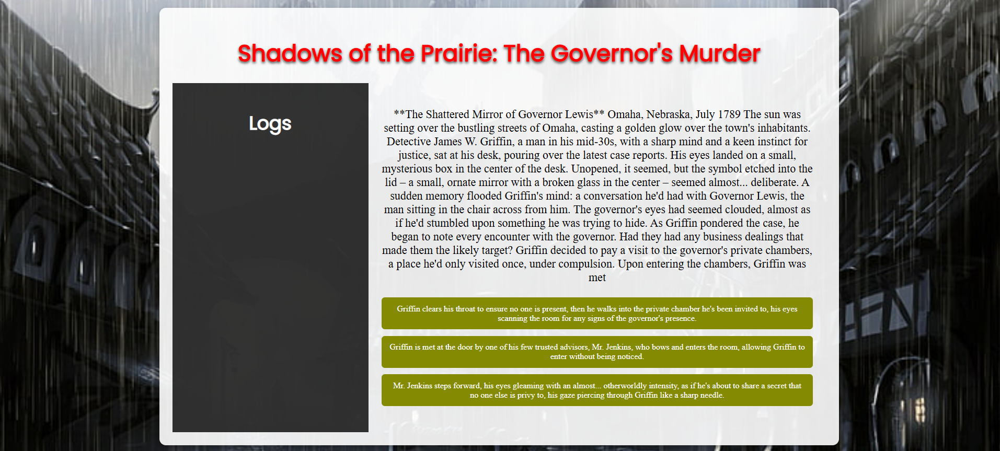

# Detective Game: Shadows of the Prairie

[](https://github.com/DeepLeau/rpg_llm/blob/main/detective_game.png)

Welcome to **Shadows of the Prairie**, a narrative-driven detective game set in the snowy plains of 18th century Nebraska. As Detective James O'Connor, you must unravel the mystery surrounding the death of Governor James Madison.

---

## Table of Contents

- [Features](#features)
- [Getting Started](#getting-started)
- [Gameplay Mechanics](#gameplay-mechanics)
- [Future Enhancements](#future-enhancements)
- [Contributing](#contributing)
- [License](#license)

---

## Features

- Immersive historical narrative based in 18th century Nebraska.
- Retrieval-Augmented Generation (RAG) system to dynamically enrich the story with contextually relevant information.
- Multiple-choice decision-making with meaningful consequences.
- Procedurally generated subplots for replayability.
- Support for WebGPU for high-performance text generation.
- Immersive sound effect

---

## Getting Started

### Prerequisites

To run the game locally, you need:

- A modern browser (Chrome, Edge, or Firefox with WebGPU support)
- A web server to serve static files (e.g., Python's `http.server`)

### Installation

1. Clone this repository:
   ```bash
   git clone https://github.com/your-username/detective-game.git
   cd detective-game
   ```

2. Start a local server:
   ```bash
   python -m http.server 8000
   ```

3. Open your browser and go to:
   [http://localhost:8000](http://localhost:8000)

---

## Gameplay Mechanics

1. **Exploration**: Investigate the world by visiting key locations, questioning witnesses, and analyzing clues.
2. **Dynamic Choices**: Make decisions that influence the story's outcome.
3. **Evidence Management**: Collect and analyze documents, objects, and testimonies to solve the case.
4. **Time Management**: Certain choices and events are time-sensitive, adding urgency to your decisions.

---

## License

This project is licensed under the MIT License - see the [LICENSE](LICENSE) file for details.
